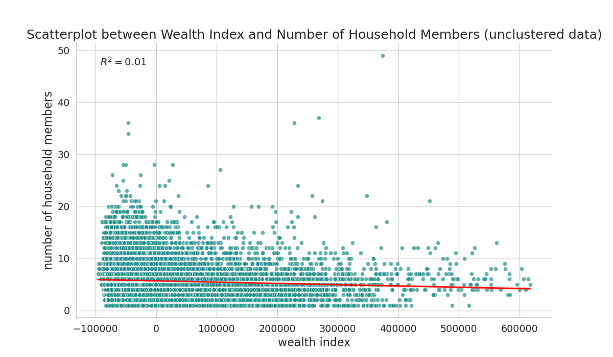

# SDG AI Lab GIS Assignment

Welcome to the GIS assignment repository for the SDG AI Lab Fellow Candidates of September 2023. The repository provides solutions to the tasks assigned, ensuring top-tier coding practices, optimal solutions, and robust documentation for easier evaluation. The codebase is structured in a manner that allows for simple reproduction and evaluation.

## Table of Contents

- [Getting Started](#getting-started)
    - [Prerequisites](#prerequisites)
    - [Setup](#setup)
- [Directory Structure](#directory-structure)
- [Tasks Overview](#tasks-overview)
- [Running the Scripts](#running-the-scripts)
- [Deliverables](#deliverables)
- [Acknowledgements](#acknowledgements)
- [Contact Information](#contact-information)

## Getting Started

### Prerequisites

- A Python environment (my environment ran on v3.11).
- Required packages and dependencies can be installed from the `environment.yml` file.
- Datasets are available at this [Google Drive link](https://drive.google.com/drive/folders/1uJ2SfuFo4H561FPj97AHZwvwT6HjJ3rn?usp=sharing).

### Setup

1. Clone the repository to your local machine.
2. Download the three data folders (e.g. 'TASK 2 Data-20230913T191955Z-001' for task 2) and move them into the local repo.
3. Navigate to the repository directory.
4. Set up a Python environment and activate it.
5. Install required packages: `conda env create -f environment.yml`
6. Activate the environment: `conda activate your_env_name`

## Directory Structure

A brief explanation of the repository's structure:

```
sdgai_assignment/
│
├── deep_learning/ # Contains deep learning model and metrics
│
├── deliverables/ - Contains all output files, plots, and results.
│
├── test/ - Test suites and cases ensuring the functions work correctly.
│
└── utils/ - Utility function files for raster, vector, deep learning, and visualization.
```


## Tasks Overview

1. **Data Processing and Mapping** - Consists of data visualization, editing, and simple analysis tasks.
2. **Geographical Data Manipulation and Management** - Focuses on raster data processing.
3. **Scene Classification by Deep Learning** - Utilizes a pretrained model to classify scenes.

Detailed task descriptions can be found in the 'GIS Recruitment Task Fall 2023.pdf' document from the repo

## Running the Scripts

- For Task 1: `python task_1.py`
- For Task 2: `python task_2.py`
- For Task 3: `python task_3.py`

Make sure to adjust to correctly configure PYTHONPATH to be in the repo.

## Deliverables

- All deliverable plots, CSVs, and raster images can be found in the `deliverables` directory.
- The assignment also outputs specific metrics and results directly to the console.


## Tasks (report)
### Task 1


### Question 8: Scatterplot Analysis

#### Objective
To explore the association between the 'wealth index' and 'number of household members' inside the Burkina Faso survey dataset.

#### Methodology
- All samples had a cluster id, related to a coordinate point.
- For every cluster, we calculate the mean household members and wealth index, via a 'group by' operation.
- Mean is chosen to better integrate outliers within a location (very high or low values).

#### Findings
1. **Correlation and R-Squared Value:**  
   - Using a scatterplot, we illustrated the relationship between the 'wealth index' and the 'number of household members'.
   - An R-squared value of 0.10 emerged, indicating that a mere 10% of the variance in household size can be linked to the wealth index.
   - Notably, a minor negative correlation was also detected.

2. **Recommendation for Further Analysis:**  
   - The Pearson correlation coefficient test is recommended for assessing the statistical significance of the observed correlation.




As an addition, we plotted wealth index against number of household numbers in the whole dataset. The resulting R-squared value is notably low at 0.01, suggesting a minimal relationship between the wealth index and household size on an overarching scale. The dataset also exhibits increased variance. It's evident that clustering the data spatially mitigates noise and variance, emphasizing spatial dynamics that correlate the two variables more distinctly at lower resolutions. Exploring methods like spatial autocorrelation could be valuable for identifying distinct patterns in various areas.

## Acknowledgements

I'd like to thank the SDG AI Lab for providing this challenging and enriching assignment. It offered an opportunity to showcase my GIS and deep learning capabilities in a practical manner.

## Contact Information

- Candidate: BARON Cedric
- Email: cedric.baron.ls@gmail.com
- LinkedIn: [linkedin](https://www.linkedin.com/in/c%C3%A9dric-baron-ab846a156/)

For any further queries or feedback regarding this assignment, please feel free to reach out.
