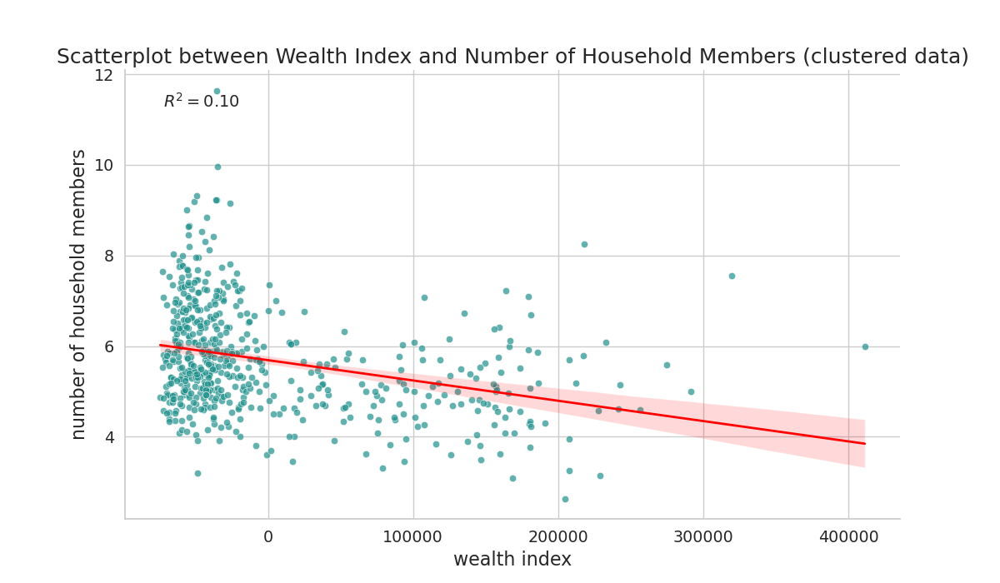
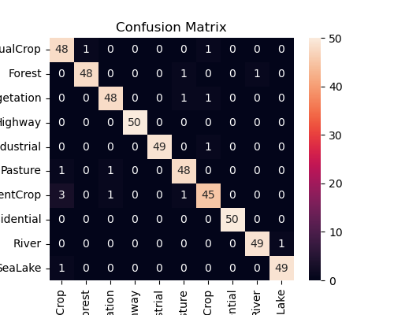

# SDG AI Lab GIS Assignment

Welcome to the GIS assignment repository for the SDG AI Lab Fellow Candidates of September 2023. The repository provides solutions to the tasks assigned, ensuring top-tier coding practices, optimal solutions, and robust documentation for easier evaluation. The codebase is structured in a manner that allows for simple reproduction and evaluation.

## Table of Contents

- [Getting Started](#getting-started)
    - [Prerequisites](#prerequisites)
    - [Setup](#setup)
- [Directory Structure](#directory-structure)
- [Tasks Overview](#tasks-overview)
- [Running the Scripts](#running-the-scripts)
- [Deliverables](#deliverables)
- [Task 1 question 8 Scatterplot Analysis](#task-1-question-8-scatterplot-analysis)
- [Task 3 question 4 transformations applied on the image](#Task-3-question-4-transformations-applied-on-the-image)
- [Task 3 question 5 report accuracy scores](#Task-3-question-5-report-accuracy-scores)
- [Coding standard](#coding-standard)
- [Acknowledgements](#acknowledgements)
- [Contact Information](#contact-information)


## Getting Started

### Prerequisites

- A Python environment (my environment ran on v3.11).
- Required packages and dependencies can be installed from the `environment.yml` file.
- The environment was built on a Linux machine, with cuda toolkit installed. If you do not have cuda drivers installed for machine learning features, you need to install the cpu version of pytorch.
- Datasets are available at this [Google Drive link](https://drive.google.com/drive/folders/1uJ2SfuFo4H561FPj97AHZwvwT6HjJ3rn?usp=sharing).

### Setup

1. Clone the repository to your local machine.
2. Download the three data folders (e.g. 'TASK 2 Data-20230913T191955Z-001' for task 2) and move them into the local repo.
3. Navigate to the repository directory.
4. Set up a Python environment and activate it.
5. Install required packages: `conda env create -f environment.yml`
6. Activate the environment: `conda activate your_env_name`

## Directory Structure

A brief explanation of the repository's structure:

```
sdgai_assignment/
│
├── deep_learning/ # Contains deep learning model and metrics
│
├── deliverables/ - Contains all output files, plots, and results.
│
├── test/ - Test suites and cases ensuring the functions work correctly.
│
└── utils/ - Utility function files for raster, vector, deep learning, and visualization.
```


## Tasks Overview

1. **Data Processing and Mapping** - Consists of data visualization, editing, and simple analysis tasks.
2. **Geographical Data Manipulation and Management** - Focuses on raster data processing.
3. **Scene Classification by Deep Learning** - Utilizes a pretrained model to classify scenes.

Detailed task descriptions can be found in the 'GIS Recruitment Task Fall 2023.pdf' document from the repo

## Running the Scripts

Make sure the PYTHONPATH is correct

``` bash
python task_1.py
python task_2.py
python task_3.py
```

Make sure to adjust to correctly configure PYTHONPATH to be in the repo.

## Running the test suite

To run the test suite, run the following in the repo
``` bash
pytest .
```

## Deliverables

- All deliverable plots, CSVs, and raster images can be found in the `deliverables` directory.
- The assignment also outputs specific metrics and results directly to the console.


## Task 1 question 8: Scatterplot Analysis




#### Objective
To explore the association between the 'wealth index' and 'number of household members' inside the Burkina Faso survey dataset.

#### Methodology
- All samples had a cluster id, related to a coordinate point.
- For every cluster, we calculate the mean household members and wealth index, via a 'group by' operation.
- Mean is chosen to better integrate outliers within a location (very high or low values).

#### Findings
1. **Correlation and R-Squared Value:**  
   - Using a scatterplot, we illustrated the relationship between the 'wealth index' and the 'number of household members'.
   - An R-squared value of 0.10 emerged, indicating that a mere 10% of the variance in household size can be linked to the wealth index.
   - Notably, a minor negative correlation was also detected.

2. **Recommendation for Further Analysis:**  
   - The Pearson correlation coefficient test is recommended for assessing the statistical significance of the observed correlation.


As an addition, we plotted wealth index against number of household numbers in the whole dataset. The resulting R-squared value is notably low at 0.01, suggesting a minimal relationship between the wealth index and household size on an overarching scale. The dataset also exhibits increased variance. It's evident that clustering the data spatially mitigates noise and variance, emphasizing spatial dynamics that correlate the two variables more distinctly at lower resolutions. Exploring methods like spatial autocorrelation could be valuable for identifying distinct patterns in various areas.

## Task 3 question 4: transformations applied on the image

1. **Resize and CenterCrop**: 
    - Images are resized to 256x256 pixels and center cropped to 224x224 pixels. This aligns with the standard input size for ResNet models pre-trained on ImageNet, ensuring the trained convolutional layers align with object sizes in the images for optimal predictions. Though CNNs are size-agnostic, the learned feature sizes are influenced by the input size during training. If we were to fine-tune our model using images of a different resolution, it might perform adequately. But in our context, given that we observe improved performance using the ImageNet default resolution, we can infer that the model was probably fine-tuned on similarly sized images.

2. **ToTensor**:
    - Converts the image from a PIL format into a PyTorch Tensor, the required data structure for operations within the PyTorch framework.

3. **Normalization**:
    - Using the same normalization parameters ensures that our input data is consistent with the distribution seen by the model during its original training. Even though it isn't explicitly stated what normalization was used during the fine-tuning process, our experiments have shown that using the ImageNet normalization provides outstanding results. This indicates that the model's fine-tuning likely used the same or similar normalization.

The formula for normalization is:
    

$$ x_n = \frac{x - \mu}{\sigma} $$

Where:
- \( x_n \) is the normalized pixel value.
- \( x \) is the original pixel value.
- \( \mu \) is the mean of the pixel values across the dataset (or for a specific channel in colored images).
- \( \sigma \) is the standard deviation of the pixel values across the dataset (or for a specific channel in colored images).

    > **NB**: Normalization improves training stability and speed. It prevents the activation function to be saturated because of high ranges of input values, which would prevent the backward propagation to work efficiently. Proper normalization ensures more stable gradients during backpropagation and more stable weight values, resulting in more effective model updates.


## Task 3 question 5: report accuracy scores

#### Metrics report

|                   | precision | recall | f1-score |
|-------------------|-----------|--------|----------|
| AnnualCrop        | 0.91      | 0.96   | 0.93     |
| Forest            | 0.98      | 0.96   | 0.97     |
| HerbaceousVegetation | 0.96   | 0.96   | 0.96     |
| Highway           | 1.00      | 1.00   | 1.00     |
| Industrial        | 1.00      | 0.98   | 0.99     |
| Pasture           | 0.94      | 0.96   | 0.95     |
| PermanentCrop     | 0.94      | 0.90   | 0.92     |
| Residential       | 1.00      | 1.00   | 1.00     |
| River             | 0.98      | 0.98   | 0.98     |
| SeaLake           | 0.98      | 0.98   | 0.98     |
| accuracy          | 0.97      |        |          |
| macro avg         | 0.97      |        |          |
| weighted avg      | 0.97      |        |          |

The model boasts an impressive accuracy of 97%. However, it's unclear if the data utilized was included in the training set, which would lead to potential 'data contamination'. If the data is not part of the training set, it should still be at least separated geographically from the data used for training and validation. This distinction ensures a more accurate representation of the model's ability to generalize on various samples in production time.

- **AnnualCrop**: Out of the model AnnualCrop predictions, 91% are correct, which indicates a lot of misclassification for this class. When the real class is AnnualCrop, the model identifies it correctly 96% of the time. The F1-score is 0.93.
- **PermanentCrop**: It has the lowest F1-score (0.92) among all classes, suggesting it's challenging for the model.

#### Confusion matrix




2. **Confusion Matrix**: the confusion matrix provides a detailed view of the model's mistakes.

- The model exhibits strong performance across most land-use classes with an impressive 97% accuracy. `Highway` and `Residential` classes have perfect scores, suggesting they possess distinct features that the model can discern easily.

- `PermanentCrop` appears to be the most challenging for the model, likely due to its similarities with other classes like `AnnualCrop`. An in-depth analysis might provide insights for improvement.


In conclusion, while the model is robust, there's potential for enhancement, especially for challenging classes. Augmenting training data or focusing on difficult classes, in a way similar to the 'hard negative mining' training approach for binary classification issues. It is also not known if the data assessing the model was used for the model or not.

## Coding standard

In the development of this assignment, a number of coding standards and best practices were adhered to ensure code quality, readability, and maintainability. Here's a brief summary:

### 1. **Static Analysis Tools**: 

- **Pylint**: Adopted to maintain a consistent coding style across the entire repository. Pylint goes beyond just checking the syntax, but it also looks for any error patterns, making sure the code adheres to PEP 8 (Python Enhancement Proposals), and even checks for refactoring opportunities. Using Pylint ensures the code is readable and maintainable by any developer who reviews or takes on this project in the future.
  
-  **Black**: In addition to Pylint for maintaining coding style, the codebase has been formatted using Black, a Python code formatter. Black ensures that the code has a consistent appearance, making it easier to read and understand.

- **Mypy**: Mypy is a static typing tool. It checks if the types of variables, return values, and function arguments match what's expected. This type checking offers an added layer of security, ensuring the integrity of the codebase.

## 2. **Testing**:

- **Pytest**: Having a robust test suite is crucial, not only to verify the correctness of the code but also to make future changes with confidence. The functions are tested as much as possible, with different scenarios, and use advanced features like mocked data for better maintenance.

## Acknowledgements

I'd like to thank the SDG AI Lab for providing this challenging and enriching assignment. It offered an opportunity to showcase my GIS and deep learning capabilities in a practical manner.

## Contact Information

- Candidate: BARON Cedric
- Email: cedric.baron.ls@gmail.com
- LinkedIn: [linkedin](https://www.linkedin.com/in/c%C3%A9dric-baron-ab846a156/)

For any further queries or feedback regarding this assignment, please feel free to reach out.
